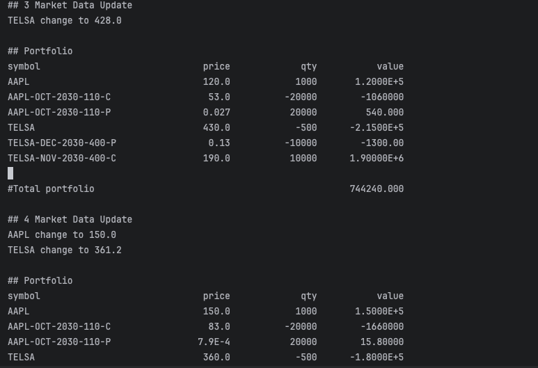

# Run Demo
- In intellij, simply run `LauncherMain`
- In terminal, goto project dir, run `./gradlew run`

# Result

# Design
this is a typical event driven app, the system reacts on external event, it can break down to follow modules.
1. **Platform(Engine)** - business neutral module, used to glue all business components together, lifecycle management, error handing and general event processing.
ideally it should have a long-running event loop, here we simply reuse the timer thread from mds. in practice, we can choose spring boot along with messaging library such as protobuf or aeron.

2. **market data service component** - used to receive external price ticks(run in dedicated thread) and forward to platform(engine)
3. **product reference service** - a static lookup service, could improve performance by enabling cache.
4. **portfolio service** - used to react on price ticks and calculate market value in realtime.
 
there is also a `PortfolioPrinter` utility to help print to console